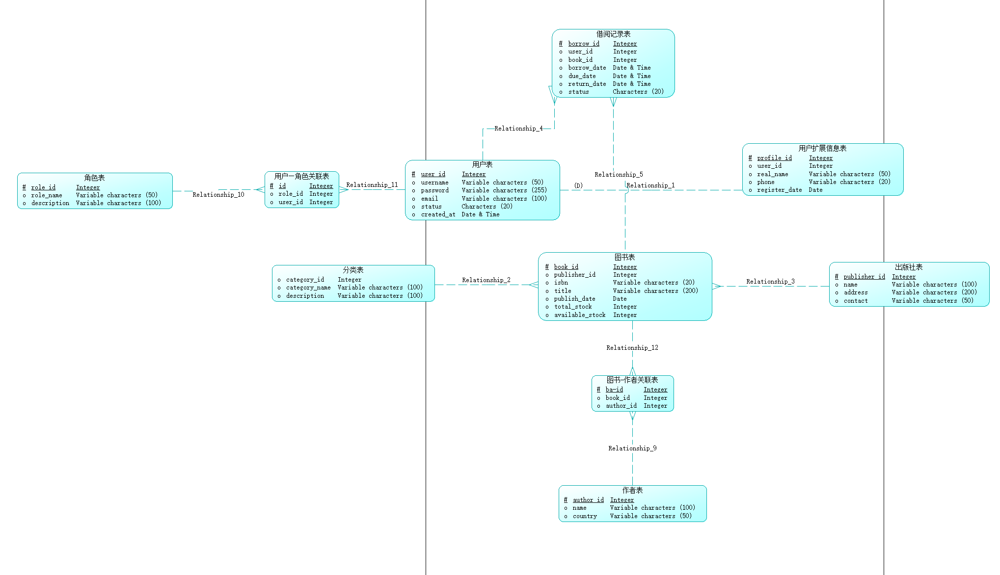
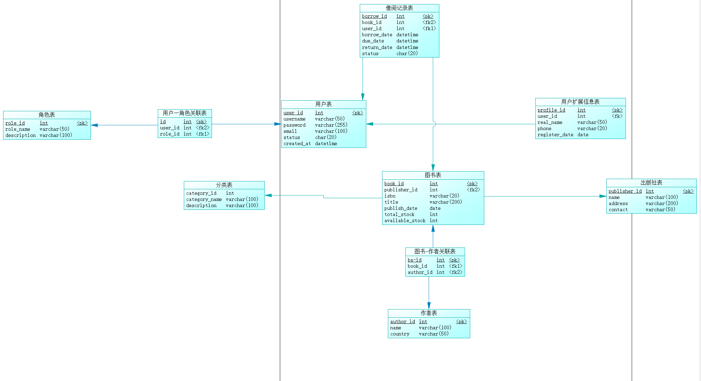

# Library Management System

## 1. Project Background and Objectives

With the development of information technology, traditional libraries have gradually exposed problems such as low efficiency, high manual costs, and scattered data in aspects like book borrowing, book maintenance, and user management. To improve the standardization, maintainability, and automation level of library management, this project designs and implements a **Web-based Library Management System**.

Based on real library business as a prototype, this system covers core functions such as user management, book management, and borrowing management, focusing on demonstrating the following capabilities:

* Analysis and abstraction ability for real business requirements
* Logical modeling (LDM) and structural design ability for relational databases
* Basic front-end and back-end collaboration ability for web applications

---

## 2. Requirements Analysis

### 2.1 System Roles and User Types

Two core roles are defined in the system:

1. **Regular User (Reader)**

   * Register and log into the system
   * Browse and search book information
   * View personal borrowing records

2. **Administrator (Admin)**

   * Log into the system
   * Maintain book basic data (Create / Read / Update / Delete)
   * Manage basic information such as authors and categories
   * View global borrowing records

The system distinguishes permissions through "user + role" rather than designing completely separate systems for different users.

---

### 2.2 Functional Requirements

#### 2.2.1 User Management Requirements

* User registration (username, password, email)
* User login and logout
* User and role association management (Regular User / Administrator)

#### 2.2.2 Book Management Requirements (Core Function)

* Add book information
* Modify book information
* Delete book information
* Query book information (support search by title, author, category, etc.)

#### 2.2.3 Author and Category Management Requirements

* A book can correspond to multiple authors
* An author can participate in writing multiple books
* Books must belong to a category

#### 2.2.4 Borrowing Management Requirements

* Record user book borrowing behavior
* Record borrowing time, due time, return time
* Support query of current and historical borrowing records

---

### 2.3 Non-functional Requirements

* **Maintainability**: Clear module division, normalized database structure
* **Consistency**: Business rules remain consistent between database and business layer
* **Extensibility**: Can add functions such as reservation, statistical reports in the future
* **Security (at specification level)**: User passwords are not stored in plain text

---

## 3. System Overall Design

Based on the requirements analysis, this chapter provides detailed design for the system's overall architecture, module division, and **front-end and back-end interface specifications**. This design serves as the basis for system implementation and as a unified interface document for team member collaborative development.

---

### 3.1 System Architecture Design

The system adopts a typical **B/S (Browser / Server) architecture** with front-end and back-end separation design:

* **Front-end (Client)**:

  * Technology: HTML + CSS + JavaScript + Bootstrap
  * Responsibilities: Page display, user interaction, sending HTTP requests to the back-end

* **Back-end (Server)**:

  * Technology: PHP (or Python Flask)
  * Responsibilities: Business logic processing, permission verification, database access, unified data return

* **Database (Database)**:

  * Technology: MySQL
  * Responsibilities: Data persistence and consistency constraints

The front-end communicates with the back-end through **HTTP/HTTPS**, with data format unified as **JSON**.

---

### 3.2 Interface Design General Conventions (Global Specifications)

To ensure unified system interface style and reduce front-end and back-end collaboration costs, all interfaces follow the following conventions.

#### 3.2.1 Request Conventions

* Request method: `GET / POST / PUT / DELETE`
* Request path: `/api/module-name/operation`
* Parameter location:

  * `GET`: Parameters passed through URL Query
  * `POST / PUT`: Parameters passed through **JSON Request Body**
  * Path parameters: Identified by `{}`, such as `/api/book/{book_id}`

---

#### 3.2.2 Unified Return Data Format

All back-end interfaces return a unified JSON structure:

```json
{
  "code": 0,
  "message": "success",
  "data": {}
}
```

* `code`: Status code

  * `0`: Success
  * Non-zero: Failure
* `message`: Result description
* `data`: Returned data content (object or array)

---

### 3.3 Module Division and Detailed Interface Design

The system is divided into the following core modules, each module interface can be independently developed and tested.

---

### 3.3.1 User Management Module

**Module Responsibilities**:

* User registration, login, and identity information query

#### Interface 1: User Registration

* **URL**: `POST /api/user/register`
* **Request Body (JSON)**:

```json
{
  "username": "string",
  "password": "string",
  "email": "string"
}
```

* **Return Data**:

```json
{
  "code": 0,
  "message": "register success",
  "data": null
}
```

---

#### Interface 2: User Login

* **URL**: `POST /api/user/login`
* **Request Body (JSON)**:

```json
{
  "username": "string",
  "password": "string"
}
```

* **Return Data**:

```json
{
  "code": 0,
  "message": "login success",
  "data": {
    "user_id": 1,
    "role": "ADMIN"
  }
}
```

---

### 3.3.2 Book Management Module

**Module Responsibilities**:

* Basic book information Create, Read, Update, Delete (core CRUD module)

#### Interface 1: Create Book

* **URL**: `POST /api/book/create`
* **Request Body (JSON)**:

```json
{
  "title": "string",
  "isbn": "string",
  "category_id": 1,
  "publisher_id": 1
}
```

* **Return Data**:

```json
{
  "code": 0,
  "message": "book created successfully",
  "data": {
    "book_id": 1
  }
}
```

---

#### Interface 2: Update Book

* **URL**: `PUT /api/book/update/{book_id}`
* **Request Body (JSON)**:

```json
{
  "title": "string",
  "category_id": 1
}
```

* **Return Data**:

```json
{
  "code": 0,
  "message": "book updated successfully",
  "data": null
}
```

---

#### Interface 3: Delete Book

* **URL**: `DELETE /api/book/delete/{book_id}`

* **Return Data**:

```json
{
  "code": 0,
  "message": "book deleted successfully",
  "data": null
}
```

---

#### Interface 4: Query Book List

* **URL**: `GET /api/book/list`
* **Query Parameters**:

  * `title` (optional)
  * `category_id` (optional)

* **Return Data**:

```json
{
  "code": 0,
  "message": "success",
  "data": [
    {
      "book_id": 1,
      "title": "Database System",
      "isbn": "978-0123456789",
      "category_id": 1,
      "category_name": "Computer Science",
      "publisher_id": 1,
      "publisher_name": "Academic Press",
      "publish_date": "2024-01-01",
      "total_stock": 10,
      "available_stock": 8
    }
  ]
}
```

---

### 3.3.3 Author Management Module

**Module Responsibilities**:

* Author information maintenance

#### Interface 1: Create Author

* **URL**: `POST /api/author/create`
* **Request Body (JSON)**:

```json
{
  "name": "string",
  "country": "string"
}
```

* **Return Data**:

```json
{
  "code": 0,
  "message": "author created successfully",
  "data": {
    "author_id": 1
  }
}
```

---

#### Interface 2: Query Author List

* **URL**: `GET /api/author/list`
* **Query Parameters**:

  * `name` (optional): Author name keyword

* **Return Data**:

```json
{
  "code": 0,
  "message": "success",
  "data": [
    {
      "author_id": 1,
      "name": "Author A",
      "country": "Country A"
    }
  ]
}
```

---

### 3.3.4 Category Management Module

**Module Responsibilities**:

* Book category maintenance

#### Interface 1: Create Category

* **URL**: `POST /api/category/create`
* **Request Body (JSON)**:

```json
{
  "category_name": "string",
  "description": "string"
}
```

* **Return Data**:

```json
{
  "code": 0,
  "message": "category created successfully",
  "data": {
    "category_id": 1
  }
}
```

---

#### Interface 2: Query Category List

* **URL**: `GET /api/category/list`

* **Return Data**:

```json
{
  "code": 0,
  "message": "success",
  "data": [
    {
      "category_id": 1,
      "category_name": "Computer Science",
      "description": "Books related to computer science"
    }
  ]
}
```

---

### 3.3.5 Borrowing Management Module

**Module Responsibilities**:

* Manage borrowing records

#### Interface 1: Create Borrowing Record

* **URL**: `POST /api/borrow/create`
* **Request Body (JSON)**:

```json
{
  "user_id": 1,
  "book_id": 1,
  "due_date": "2025-01-01"
}
```

* **Return Data**:

```json
{
  "code": 0,
  "message": "borrow record created successfully",
  "data": {
    "borrow_id": 1
  }
}
```

---

#### Interface 2: Return Book

* **URL**: `PUT /api/borrow/return/{borrow_id}`

* **Return Data**:

```json
{
  "code": 0,
  "message": "book returned successfully",
  "data": null
}
```

---

#### Interface 3: Query User Borrowing Records

* **URL**: `GET /api/borrow/user/{user_id}`

* **Return Data**:

```json
{
  "code": 0,
  "message": "success",
  "data": [
    {
      "borrow_id": 1,
      "user_id": 1,
      "username": "Alice",
      "book_id": 1,
      "book_title": "Database System",
      "borrow_date": "2024-12-01T10:00:00Z",
      "due_date": "2025-01-01T10:00:00Z",
      "return_date": null,
      "status": "borrowed"
    }
  ]
}
```

---

### 3.3.6 Data Query and Analytics Module

---

#### Module Responsibilities

* Unifiedly handle complex SQL query logic
* Provide query interfaces externally, avoiding complex SQL scattered in business modules
* Support concentrated demonstration of SQL capabilities in teaching and evaluation scenarios

---

### Interface 1: Join Query (Inner / Outer)

* **URL**: `GET /api/query/book-authors`

* **Request Parameters (Query)**:

  * `book_id` (int, optional)

* **Return Data**:

```json
{
  "code": 0,
  "message": "success",
  "data": [
    {
      "book_id": 1,
      "book_title": "Database System",
      "author_id": 1,
      "author_name": "Author A",
      "country": "Country A"
    }
  ]
}
```

---

### Interface 2: Self Join Query

* **URL**: `GET /api/query/category-tree`

* **Request Parameters**: None

* **Return Data**:

```json
{
  "code": 0,
  "message": "success",
  "data": [
    {
      "category_id": 1,
      "category_name": "Computer Science",
      "parent_category_id": null,
      "parent_category_name": null
    },
    {
      "category_id": 2,
      "category_name": "Database",
      "parent_category_id": 1,
      "parent_category_name": "Computer Science"
    }
  ]
}
```

---

### Interface 3: Aggregation Query (GROUP BY / ORDER BY)

* **URL**: `GET /api/query/book-count-by-category`

* **Request Parameters**: None

* **Return Data**:

```json
{
  "code": 0,
  "message": "success",
  "data": [
    {
      "category_id": 1,
      "category_name": "Computer Science",
      "book_count": 10
    },
    {
      "category_id": 2,
      "category_name": "Mathematics",
      "book_count": 5
    }
  ]
}
```

---

### Interface 4: Date and Time Function Query

* **URL**: `GET /api/query/overdue-borrow`

* **Request Parameters**: None

* **Return Data**:

```json
{
  "code": 0,
  "message": "success",
  "data": [
    {
      "borrow_id": 1,
      "user_id": 1,
      "username": "Alice",
      "book_id": 1,
      "book_title": "Database System",
      "borrow_date": "2024-11-01T10:00:00Z",
      "due_date": "2024-11-30T10:00:00Z",
      "days_overdue": 27
    }
  ]
}
```

---

### Interface 5: Subquery

* **URL**: `GET /api/query/users-borrowed-book/{book_id}`

* **Path Parameters**:

  * `book_id` (int): Book ID

* **Return Data**:

```json
{
  "code": 0,
  "message": "success",
  "data": [
    {
      "user_id": 1,
      "username": "Alice",
      "borrow_date": "2024-12-01T10:00:00Z"
    }
  ]
}
```

---

### Interface 6: Correlated Subquery

* **URL**: `GET /api/query/most-active-users`

* **Request Parameters**: None

* **Return Data**:

```json
{
  "code": 0,
  "message": "success",
  "data": [
    {
      "user_id": 2,
      "username": "Bob",
      "borrow_count": 12
    }
  ]
}
```

---

### Interface 7: Set Operations

* **URL**: `GET /api/query/active-or-admin-users`

* **Request Parameters**: None

* **Return Data**:

```json
{
  "code": 0,
  "message": "success",
  "data": [
    {
      "user_id": 1,
      "username": "Alice",
      "role": "READER"
    },
    {
      "user_id": 3,
      "username": "Admin",
      "role": "ADMIN"
    }
  ]
}
```

---

### Interface 8: Multi-table Join Query

* **URL**: `GET /api/query/borrow-detail`

* **Request Parameters (Query)**:

  * `user_id` (int, optional)

* **Return Data**:

```json
{
  "code": 0,
  "message": "success",
  "data": [
    {
      "borrow_id": 1,
      "user_id": 1,
      "username": "Alice",
      "book_id": 1,
      "book_title": "Database System",
      "author_names": "Author A, Author B",
      "category_name": "Computer Science",
      "borrow_date": "2024-12-01T10:00:00Z",
      "due_date": "2025-01-01T10:00:00Z",
      "return_date": null,
      "status": "borrowed"
    }
  ]
}
```

---

### Interface 9: Division Query

* **URL**: `GET /api/query/users-borrowed-all-categories`

* **Request Parameters**: None

* **Return Data**:

```json
{
  "code": 0,
  "message": "success",
  "data": [
    {
      "user_id": 5,
      "username": "Charlie"
    }
  ]
}
```

---

## 4. Database Logical Data Model (LDM, Complete Field Description Version)

All entities satisfy **Third Normal Form (3NF)**, with field types designed for MySQL as the target database.

---

### 4.1 Entity Overview (for drawing LDM diagram)

| No. | Entity Name | Description |
| --- | ----------- | ------------ |
| E1  | User        | Basic user information in the system |
| E2  | UserProfile | User extended information (1:1) |
| E3  | Role        | System roles |
| E4  | UserRole    | User-role association (M:N) |
| E5  | Book        | Basic book information |
| E6  | Author      | Author information |
| E7  | BookAuthor  | Book-author association (M:N) |
| E8  | Category    | Book categories |
| E9  | Publisher   | Publisher information |
| E10 | Borrow      | Borrowing records |

---

### 4.2 Detailed Field Description for Each Entity (Core)

### 4.2.1 User (User Table)

**Business Meaning**:
Basic account information for all users who can log into the system.

| Field Name   | Type         | Primary Key | Foreign Key | Description |
| ---------- | ------------ | ----------- | ----------- | ----------- |
| user_id    | INT          | ✔           |             | Unique user identifier, auto-increment |
| username   | VARCHAR(50)  |             |             | Login username, unique |
| password   | VARCHAR(255) |             |             | Encrypted password |
| email      | VARCHAR(100) |             |             | Email |
| status     | TINYINT      |             |             | Status: 1=enabled, 0=disabled |
| created_at | DATETIME     |             |             | Registration time |

---

### 4.2.2 UserProfile (User Extended Information Table)

**Business Meaning**:
Stores user's personal attribute information, one-to-one association with User.

| Field Name      | Type          | Primary Key | Foreign Key | Description |
| ------------- | ----------- | ----------- | ----------- | ----------- |
| profile_id    | INT         | ✔           |             | Primary key |
| user_id       | INT         |             | ✔           | Reference User(user_id) |
| real_name     | VARCHAR(50) |             |             | Real name |
| phone         | VARCHAR(20) |             |             | Contact phone |
| register_date | DATE        |             |             | Registration date |

---

### 4.2.3 Role (Role Table)

**Business Meaning**:
Role types defined in the system.

| Field Name    | Type          | Primary Key | Foreign Key | Description |
| ----------- | ------------ | ----------- | ----------- | ----------- |
| role_id     | INT          | ✔           |             | Role ID |
| role_name   | VARCHAR(50)  |             |             | Role name (ADMIN / READER) |
| description | VARCHAR(100) |             |             | Role description |

---

### 4.2.4 UserRole (User-Role Association Table)

**Business Meaning**:
Implements the many-to-many relationship between User and Role.

| Field Name | Type | Primary Key | Foreign Key | Description |
| ------- | ---- | ----------- | ----------- | ----------- |
| id      | INT  | ✔           |             | Primary key |
| user_id | INT  |             | ✔           | Reference User |
| role_id | INT  |             | ✔           | Reference Role |

---

### 4.2.5 Book (Book Table)

**Business Meaning**:
Basic information for all books in the system.

| Field Name      | Type          | Primary Key | Foreign Key | Description |
| --------------- | ------------ | ----------- | ----------- | ----------- |
| book_id         | INT          | ✔           |             | Book ID |
| isbn            | VARCHAR(20)  |             |             | ISBN number |
| title           | VARCHAR(200) |             |             | Book title |
| category_id     | INT          |             | ✔           | Category |
| publisher_id    | INT          |             | ✔           | Publisher |
| publish_date    | DATE         |             |             | Publication date |
| total_stock     | INT          |             |             | Total stock |
| available_stock | INT          |             |             | Available stock |

---

### 4.2.6 Author (Author Table)

**Business Meaning**:
Stores basic author information.

| Field Name  | Type          | Primary Key | Foreign Key | Description |
| --------- | ------------ | ----------- | ----------- | ----------- |
| author_id | INT          | ✔           |             | Author ID |
| name      | VARCHAR(100) |             |             | Author name |
| country   | VARCHAR(50)  |             |             | Country |

---

### 4.2.7 BookAuthor (Book-Author Association Table)

**Business Meaning**:
Implements the many-to-many relationship between Book and Author.

| Field Name  | Type | Primary Key | Foreign Key | Description |
| --------- | ---- | ----------- | ----------- | ----------- |
| id        | INT  | ✔           |             | Primary key |
| book_id   | INT  |             | ✔           | Reference Book |
| author_id | INT  |             | ✔           | Reference Author |

---

### 4.2.8 Category (Category Table)

**Business Meaning**:
Book category information, used for queries and statistics.

| Field Name      | Type          | Primary Key | Foreign Key | Description |
| ------------- | ------------ | ----------- | ----------- | ----------- |
| category_id   | INT          | ✔           |             | Category ID |
| category_name | VARCHAR(100) |             |             | Category name |
| description   | VARCHAR(200) |             |             | Category description |
| parent_id     | INT          |             | ✔           | Parent category ID, used for self-join queries |

---

### 4.2.9 Publisher (Publisher Table)

**Business Meaning**:
Book publisher information.

| Field Name   | Type          | Primary Key | Foreign Key | Description |
| ------------ | ------------ | ----------- | ----------- | ----------- |
| publisher_id | INT          | ✔           |             | Publisher ID |
| name         | VARCHAR(100) |             |             | Publisher name |
| address      | VARCHAR(200) |             |             | Address |
| contact      | VARCHAR(50)  |             |             | Contact |

---

### 4.2.10 Borrow (Borrowing Record Table)

**Business Meaning**:
Records user book borrowing behavior.

| Field Name    | Type       | Primary Key | Foreign Key | Description |
| ----------- | -------- | ----------- | ----------- | ----------- |
| borrow_id   | INT      | ✔           |             | Borrowing record ID |
| user_id     | INT      |             | ✔           | Borrowing user |
| book_id     | INT      |             | ✔           | Borrowed book |
| borrow_date | DATETIME |             |             | Borrowing time |
| due_date    | DATETIME |             |             | Due time |
| return_date | DATETIME |             |             | Actual return time (nullable) |
| status      | ENUM     |             |             | borrowed / returned / overdue |

---

### 4.3 Entity Relationship Summary

* **One-to-One (1:1)**

  * User —— UserProfile
* **One-to-Many (1:N)**

  * Category —— Book
  * Publisher —— Book
  * User —— Borrow
  * Book —— Borrow
* **Many-to-Many (M:N)**

  * User —— Role (via UserRole)
  * Book —— Author (via BookAuthor)

---

### 4.4 Data Model Diagrams

The following diagrams illustrate the logical and physical data models for the Library Management System:





---

## 5. Division of Labor and Implementation Suggestions

* **Database Designers**: Draw LDM / PDM based on Chapter 4 content and generate MySQL scripts
* **Back-end Developers**: Implement APIs based on Chapter 3 interface design
* **Front-end Developers**: Complete pages and interaction logic based on module interfaces
* **Documentation and Testing Personnel**: Responsible for SQL query organization and testing screenshots

---

## 6. Summary

This document serves as the unified requirements and design basis for the Library Management System project, detailing system functions, module division, interface design, and database logical model.